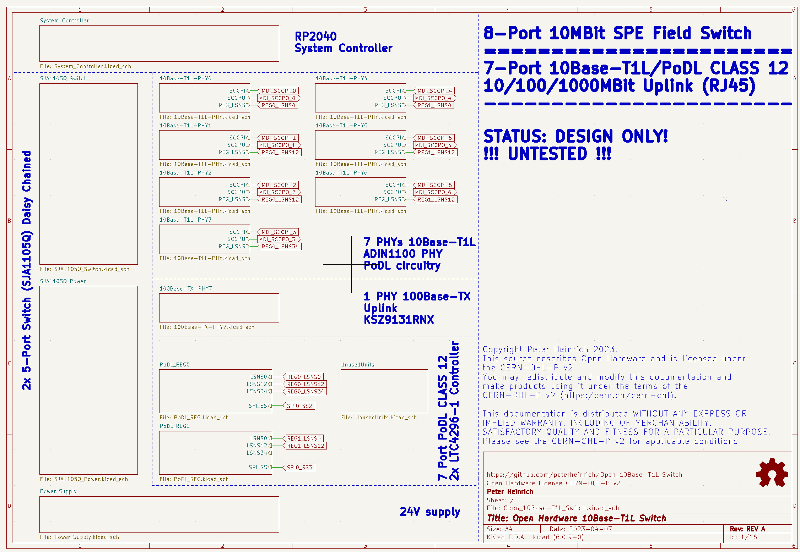
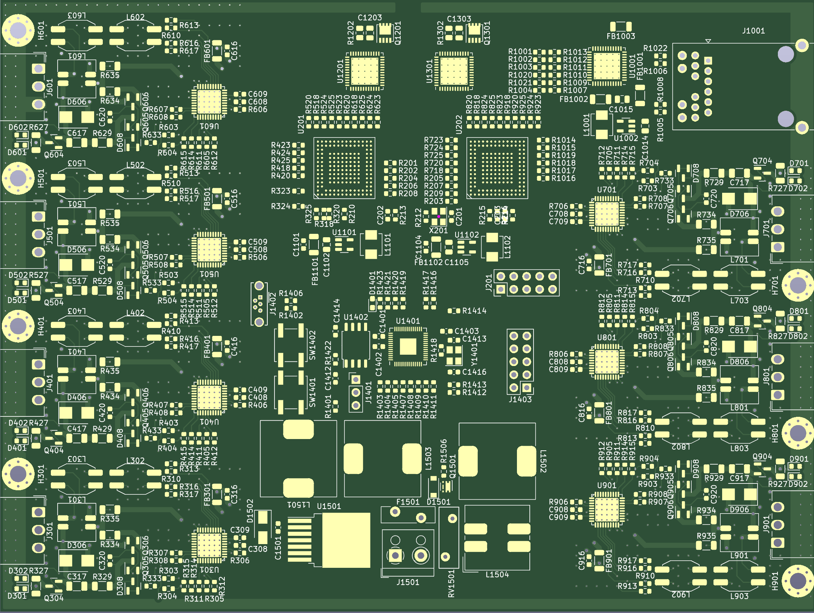
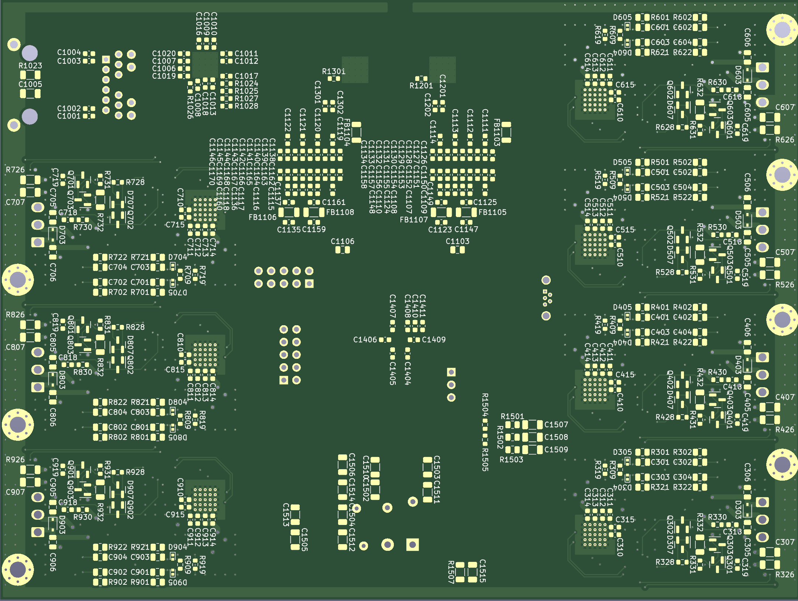

# Open_10Base-T1L_Switch
Open Hardware 7-Port 10Base-T1L and 1-Port 20/100/1000Base-T Field Switch Design

Schematic: [Open_10Base-T1L_Switch-sch.pdf](Open_10Base-T1L_Switch-sch.pdf)

## Architecture ##
Two 5-port switch ICs (SJA1105Q) form the basis of the design. Daisy chaining the two ICs gives a total of 8 ports.
Seven of these ports are attachted to 10Base-T1L PHYs (ADIN1100), while one port is attached to a 1000Base-T PHY (KSZ9131) as uplink. 

Each of the 10Base-T1L ports offer power over datalines utilizing two 5-Port power management controllers (LTC4296) with SCC support for power delivery negotiation. The design is 24V only and supports PoDL Class 12.

An RP2040 functions as a system controller configuring the switch components.

## Current Placement ##

